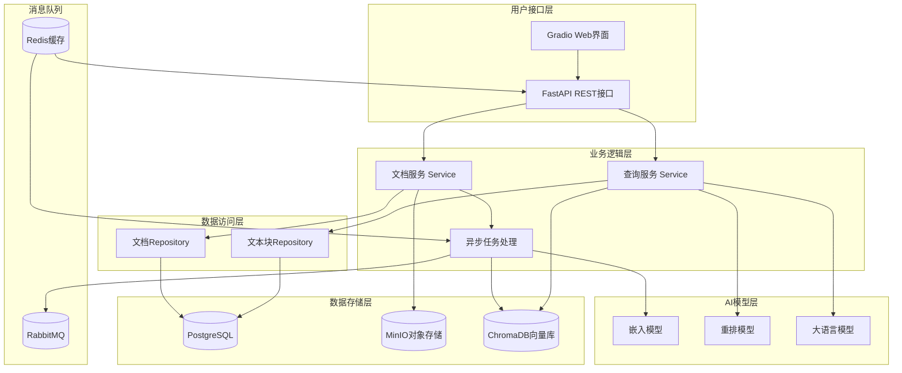
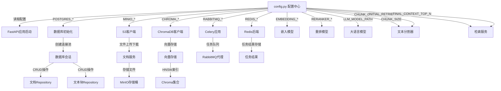
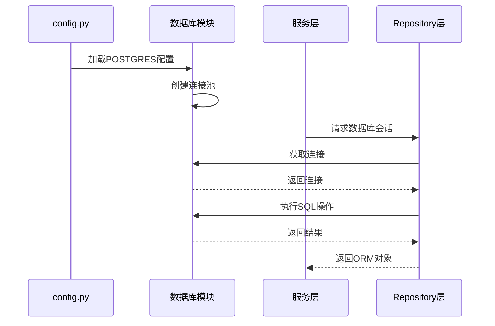
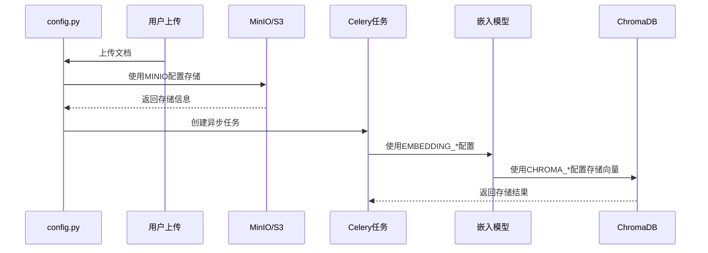
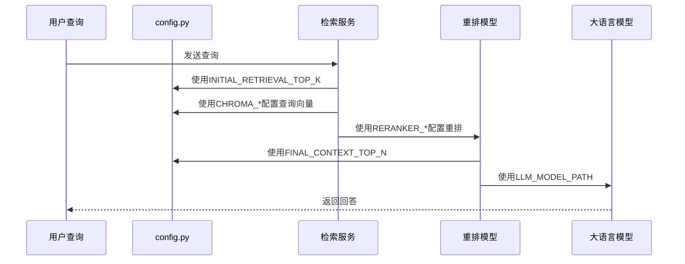
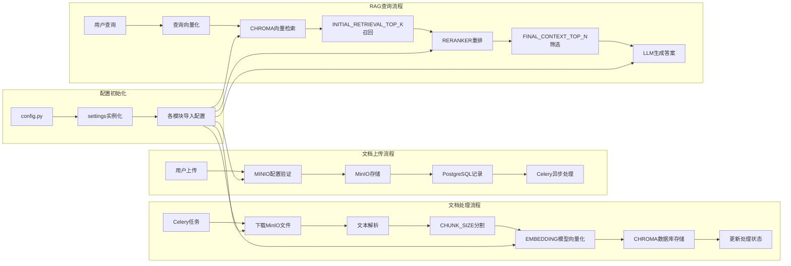

# 🏗️ MemeMind 系统架构与配置流程图

## 📋 **系统整体架构图**



## ⚙️ **配置参数流转图**



## 🔍 **详细配置使用场景分析**

### 1️⃣ **数据库配置流程**


### 2️⃣ **文档处理配置流程**


### 3️⃣ **RAG查询配置流程**


## 📊 **配置参数依赖关系表**

| 配置项 | 使用模块 | 依赖关系 | 影响范围 |
|--------|----------|----------|----------|
| `POSTGRES_*` | `database.py`, `*.py` | 数据库连接 | 全局数据持久化 |
| `MINIO_*` | `s3_client.py` | 对象存储 | 文件上传下载 |
| `CHROMA_*` | `chromadb_client.py` | 向量数据库 | RAG检索 |
| `RABBITMQ_*` | `celery_app.py` | 消息队列 | 异步任务 |
| `REDIS_*` | `celery_app.py` | 结果缓存 | 任务结果存储 |
| `EMBEDDING_*` | `embedding_qwen.py` | 嵌入模型 | 向量生成 |
| `RERANKER_*` | `reranker_qwen.py` | 重排模型 | 结果精排 |
| `LLM_MODEL_PATH` | `llm_qwen.py` | 语言模型 | 答案生成 |
| `CHUNK_SIZE` | `doc_process.py` | 文本分割 | 文档处理 |
| `CHUNK_OVERLAP` | `doc_process.py` | 文本重叠 | 文档处理 |
| `INITIAL_RETRIEVAL_TOP_K` | `query_service.py` | 初始召回 | RAG检索 |
| `FINAL_CONTEXT_TOP_N` | `query_service.py` | 最终上下文 | RAG检索 |

## 🔄 **数据流转详细图**



## 🎯 **配置优化建议**

### 1️⃣ **性能相关配置**
```python
# 文本处理优化
CHUNK_SIZE: int = 1024  # 增大块大小，减少总块数
CHUNK_OVERLAP: int = 100  # 适当重叠，保持上下文

# 检索优化
INITIAL_RETRIEVAL_TOP_K: int = 50  # 初始召回数量
FINAL_CONTEXT_TOP_N: int = 5      # 最终上下文数量

# 内存优化
EMBEDDING_BATCH_SIZE: int = 20    # 嵌入模型批处理大小
```

### 2️⃣ **资源配置建议**
- **PostgreSQL**: 根据文档数量调整连接池大小
- **MinIO**: 确保存储空间充足，设置合适的访问策略
- **ChromaDB**: 监控向量索引大小，适时优化HNSW参数
- **RabbitMQ**: 根据任务量调整队列配置
- **Redis**: 设置合理的过期时间，避免内存溢出

### 3️⃣ **监控配置**
- 添加配置参数验证
- 实现配置热重载
- 设置资源使用监控
- 配置错误告警机制

这个流程图展示了整个MemeMind系统的架构和配置流转关系，帮助你更好地理解各个组件之间的交互和配置参数的使用场景。