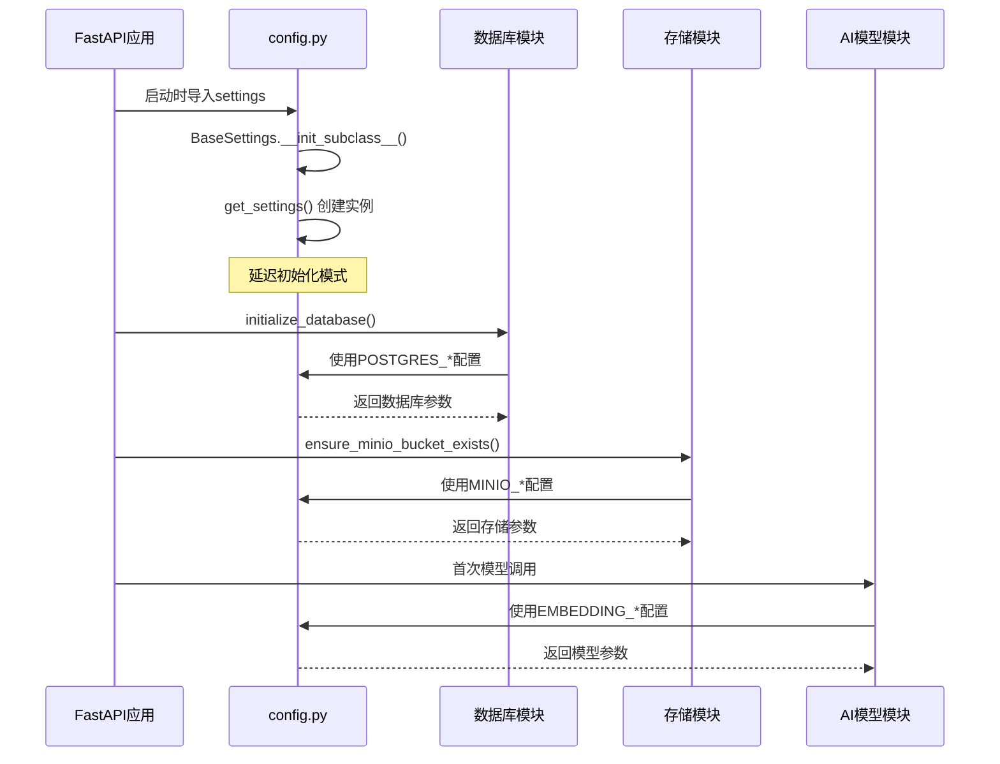
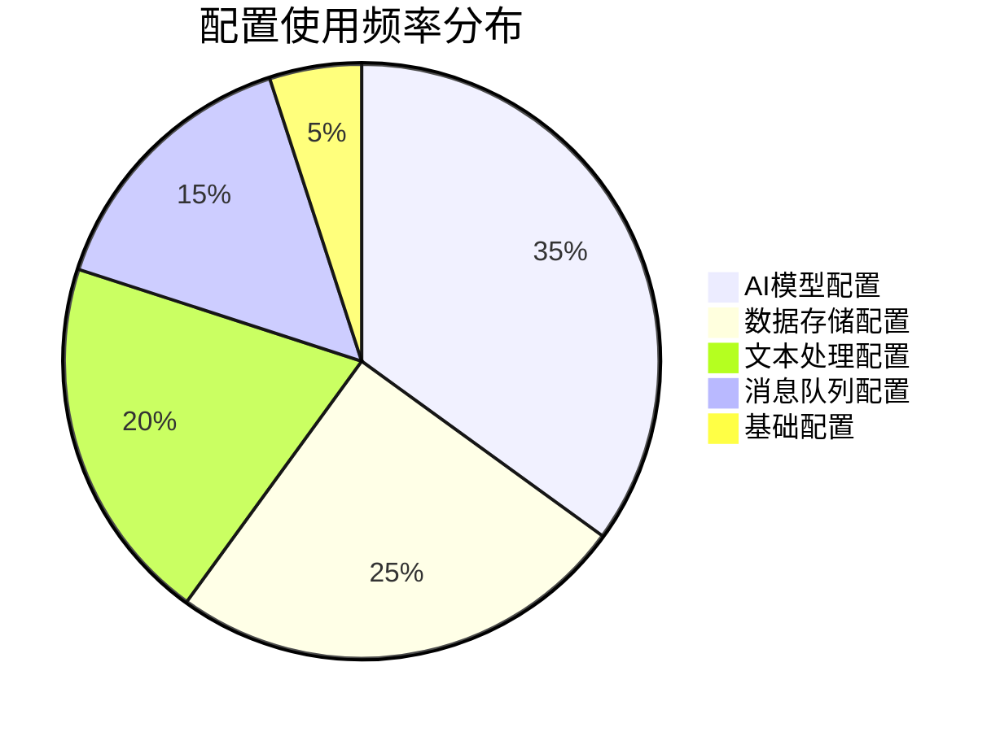
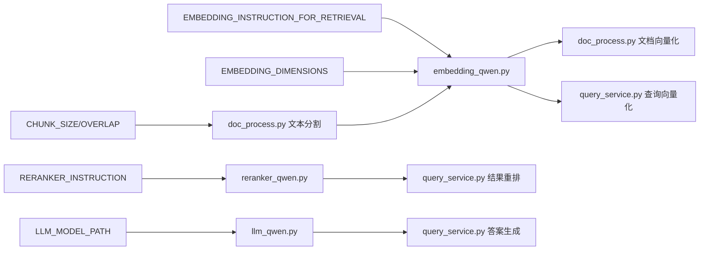
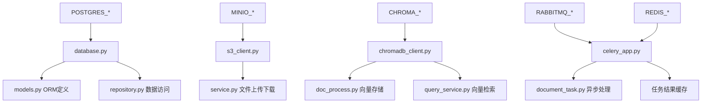
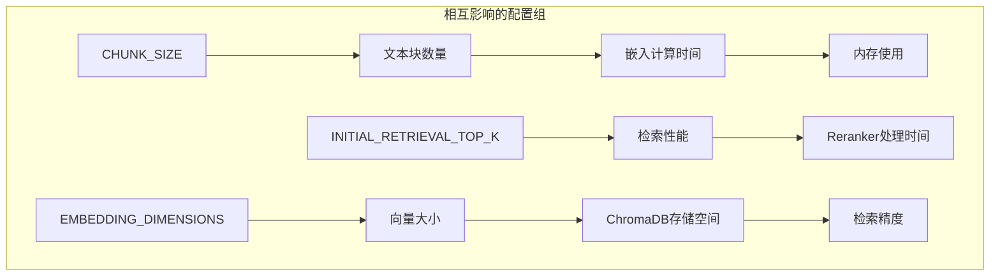

# 🔗 Config.py 配置依赖关系图

## 🌟 **配置参数依赖关系总览**

```mermaid
graph TB
    %% 核心配置中心
    subgraph "配置中心 (config.py)"
        Config[BaseConfig]
        Settings[get_settings()]
        Base[BaseSettings]
    end

    %% 数据存储层配置
    subgraph "数据存储配置"
        PG[POSTGRES_*]
        MINIO[MINIO_*]
        CHROMA[CHROMA_*]
        REDIS[REDIS_*]
    end

    %% 消息队列配置
    subgraph "消息队列配置"
        RABBITMQ[RABBITMQ_*]
        CELERY_QUEUE[task_routes]
    end

    %% AI模型配置
    subgraph "AI模型配置"
        EMBEDDING[EMBEDDING_*]
        RERANKER[RERANKER_*]
        LLM[LLM_MODEL_PATH]
    end

    %% 文本处理配置
    subgraph "文本处理配置"
        CHUNK[CHUNK_SIZE/OVERLAP]
        RETRIEVAL[TOP_K参数]
    end

    %% 依赖关系
    Config --> Base
    Base --> Settings
    Settings --> PG
    Settings --> MINIO
    Settings --> CHROMA
    Settings --> RABBITMQ
    Settings --> REDIS
    Settings --> EMBEDDING
    Settings --> RERANKER
    Settings --> LLM
    Settings --> CHUNK
    Settings --> RETRIEVAL

    %% 依赖分组
    PG -.->|数据库连接| DatabaseLayer[数据库层]
    MINIO -.->|对象存储| ObjectLayer[存储层]
    CHROMA -.->|向量存储| VectorLayer[向量层]
    RABBITMQ -.->|任务队列| QueueLayer[队列层]
    EMBEDDING -.->|嵌入生成| EmbeddingLayer[嵌入层]
    RERANKER -.->|结果重排| RerankerLayer[重排层]
    LLM -.->|答案生成| LLMLayer[语言模型层]
    CHUNK -.->|文本分割| TextLayer[文本处理层]
```

## 🔄 **配置加载时序图**



## 📊 **配置使用频率分析**



## 🔗 **配置参数详细依赖链**

### 1️⃣ **AI模型配置依赖链**


### 2️⃣ **数据存储配置依赖链**


### 3️⃣ **配置参数相互影响关系**


## 🎯 **配置影响评估矩阵**

| 配置变更 | 影响组件 | 性能影响 | 内存影响 | 风险等级 | 建议操作 |
|----------|----------|----------|----------|----------|----------|
| `CHUNK_SIZE` | 文本处理,嵌入 | ⬆️⬇️ | ⬆️⬇️ | 🟡 中 | 需要测试 |
| `CHUNK_OVERLAP` | 文本处理 | ⬇️ | ⬆️ | 🟢 低 | 随时调整 |
| `INITIAL_RETRIEVAL_TOP_K` | 检索性能 | ⬇️ | ⬇️ | 🟡 中 | 谨优时调整 |
| `FINAL_CONTEXT_TOP_N` | 生成质量 | ⬆️ | ⬇️ | 🟢 低 | 根据需求调整 |
| `EMBEDDING_BATCH_SIZE` | 内存使用 | ⬇️ | ⬆️⬇️ | 🟡 中 | 根据硬件调整 |
| `EMBEDDING_INSTRUCTION` | 检索精度 | ⬆️⬇️ | ➡️ | 🟠 高 | 需要评估 |

## 🔧 **配置优化建议**

### 🚀 **性能优化配置**
```python
# 高性能配置示例
class HighPerformanceConfig(BaseConfig):
    # 文本处理优化
    CHUNK_SIZE: int = 2048  # 大块处理
    CHUNK_OVERLAP: int = 200  # 保持上下文

    # 检索优化
    INITIAL_RETRIEVAL_TOP_K: int = 100  # 大量召回
    FINAL_CONTEXT_TOP_N: int = 10  # 更多上下文

    # 并发优化
    EMBEDDING_BATCH_SIZE: int = 50  # 大批处理
```

### 💾 **内存优化配置**
```python
# 内存优化配置示例
class MemoryOptimizedConfig(BaseConfig):
    # 文本处理优化
    CHUNK_SIZE: int = 512  # 小块处理
    CHUNK_OVERLAP: int = 50  # 最小重叠

    # 检索优化
    INITIAL_RETRIEVAL_TOP_K: int = 20  # 减少召回
    FINAL_CONTEXT_TOP_N: int = 3  # 精简上下文

    # 批处理优化
    EMBEDDING_BATCH_SIZE: int = 10  # 小批处理
```

### 🎯 **精度优化配置**
```python
# 高精度配置示例
class AccuracyOptimizedConfig(BaseConfig):
    # 文本处理优化
    CHUNK_SIZE: int = 768  # 中等块大小
    CHUNK_OVERLAP: int = 150  # 大重叠

    # 检索优化
    INITIAL_RETRIEVAL_TOP_K: int = 200  # 大量召回
    FINAL_CONTEXT_TOP_N: int = 15  # 丰富上下文

    # 模型优化
    EMBEDDING_BATCH_SIZE: int = 1  # 单个处理确保精度
```

## 📋 **配置变更检查清单**

### 🔍 **变更前检查**
- [ ] 备份当前配置文件
- [ ] 确认测试环境可用
- [ ] 评估影响范围
- [ ] 准备回滚方案

### 🧪 **变更中测试**
- [ ] 单元测试通过
- [ ] 集成测试验证
- [ ] 性能基准测试
- [ ] 内存使用监控

### ✅ **变更后验证**
- [ ] 功能验证完成
- [ ] 性能指标正常
- [ ] 错误日志检查
- [ ] 用户反馈收集

这个配置依赖关系图帮助你理解整个系统中各个配置参数之间的关系和影响，便于进行系统优化和问题排查。