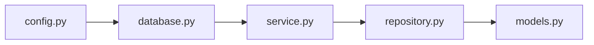
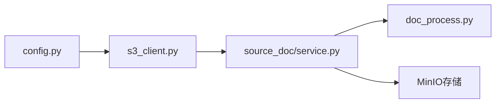
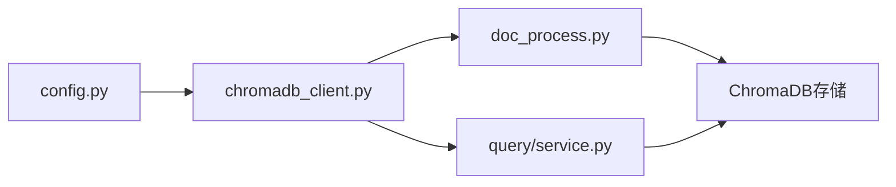
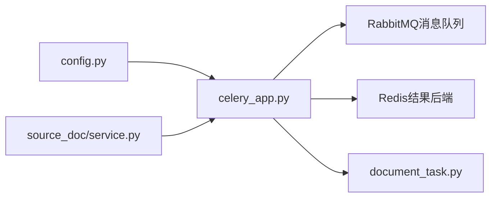

# 🔍 Config.py 配置参数使用追踪

## 📊 **配置参数详细使用分析**

### 1️⃣ **数据库配置 (POSTgreSQL)**

#### 🔧 **配置参数**
```python
POSTGRES_HOST: str = "localhost"
POSTGRES_PORT: str = "5432"
POSTGRES_DB: str = "mememind"
POSTGRES_USER: str = "postgres"
POSTGRES_PASSWORD: str = "12345678"
```

#### 📍 **使用位置追踪**
```
app/core/database.py:28-32
    ├── create_engine_and_session() - 创建数据库连接
    ├── initialize_database_for_fastapi() - 应用启动初始化
    └── create_engine_and_session_for_celery() - Celery专用连接

app/models/models.py
    ├── Base.metadata.create_all() - 表结构创建
    └── 所有ORM模型定义

app/source_doc/repository.py:15-20
    ├── SourceDocumentRepository.__init__ - 依赖注入数据库会话
    ├── CRUD操作: create(), get_by_id(), get_all(), update(), delete()

app/text_chunk/repository.py:15-20
    ├── TextChunkRepository.__init__ - 依赖注入数据库会话
    ├── CRUD操作和批量处理方法
```

#### 🔄 **数据流转路径**


---

### 2️⃣ **对象存储配置 (MinIO)**

#### 🔧 **配置参数**
```python
MINIO_ENDPOINT: str = "localhost:9000"
MINIO_ACCESS_KEY: str = "minioadmin"
MINIO_SECRET_KEY: str = "minioadmin"
MINIO_USE_SSL: bool = False
MINIO_BUCKET: str = "mememind"
```

#### 📍 **使用位置追踪**
```
app/core/s3_client.py:15-25
    ├── s3_client = boto3.client() - 创建S3客户端
    ├── get_s3_client() - 获取客户端实例
    └── ensure_minio_bucket_exists() - 确保存储桶存在

app/source_doc/service.py:102-109
    ├── add_document() - 上传文件到MinIO
    └── s3_client.upload_fileobj() - 文件对象上传

app/source_doc/service.py:276-280
    ├── download_document() - 从MinIO下载文件
    └── s3_client.get_object() - 获取文件对象

app/source_doc/service.py:250-253
    ├── delete_document() - 从MinIO删除文件
    └── s3_client.delete_object() - 删除对象操作

app/tasks/utils/doc_process.py:88-94
    ├── _execute_document_processing_async() - 异步处理下载
    └── asyncio.to_thread(s3_client.get_object) - 异步下载
```

#### 🔄 **数据流转路径**


---

### 3️⃣ **向量数据库配置 (ChromaDB)**

#### 🔧 **配置参数**
```python
CHROMA_HTTP_ENDPOINT: str = "http://localhost:5500"
CHROMA_COLLECTION_NAME: str = "mememind_rag_collection"
```

#### 📍 **使用位置追踪**
```
app/core/chromadb_client.py:15-35
    ├── get_chroma_collection() - 获取或创建集合
    ├── chromadb.HttpClient() - 创建HTTP客户端
    └── collection.create_if_not_exists() - 集合管理

app/tasks/utils/doc_process.py:316-327
    ├── _execute_document_processing_async() - 向量存储
    ├── chroma_collection.add() - 添加向量数据
    └── metadata构建和关联

app/query/service.py:25-35
    ├── QueryService.__init__ - 初始化Chroma客户端
    └── 向量检索和相似度搜索

app/query/routes.py:15-25
    ├── retrieve_chunks() - 向量检索API
    └── get_retrieval_results() - 获取检索结果
```

#### 🔄 **数据流转路径**


---

### 4️⃣ **消息队列配置 (RabbitMQ + Redis)**

#### 🔧 **配置参数**
```python
RABBITMQ_HOST: str = "localhost:5672"
RABBITMQ_USER: str = "admin"
RABBITMQ_PASSWORD: str = "admin123"

REDIS_HOST: str = "localhost:6379"
```

#### 📍 **使用位置追踪**
```
app/core/celery_app.py:120-131
    ├── CELERY_BROKER_URL = f"amqp://{RABBITMQ_USER}:{RABBITMQ_PASSWORD}@{RABBITMQ_HOST}/"
    ├── CELERY_RESULT_BACKEND = f"redis://{REDIS_HOST}/2"
    ├── celery_app = Celery() - 创建Celery应用
    └── task_routes配置 - 任务路由设置

app/core/celery_app.py:141-147
    ├── task_routes = {"app.tasks.document_task.*": {"queue": "document_queue"}}
    ├── 任务队列路由映射
    └── 队列优先级配置

app/source_doc/service.py:179-186
    ├── add_document() - 提交异步任务
    ├── process_document_task.delay() - 异步任务调用
    └── 任务ID记录和日志

app/tasks/document_task.py:15-25
    ├── process_document_task() - 任务执行入口
    ├── asyncio.run() - 事件循环管理
    └── 任务结果处理
```

#### 🔄 **数据流转路径**


---

### 5️⃣ **AI模型配置**

#### 🔧 **嵌入模型配置**
```python
EMBEDDING_INSTRUCTION_FOR_RETRIEVAL: str = "为这个句子生成表示以用于检索相关文章"
EMBEDDING_DIMENSIONS: int = 1024
```

#### 📍 **使用位置追踪**
```
app/core/embedding_qwen.py:25-35
    ├── get_embeddings() - 主要嵌入生成函数
    ├── _load_embedding_model() - 模型加载和初始化
    ├── EMBEDDING_INSTRUCTION_FOR_RETRIEVAL - 模型指令
    └── EMBEDDING_DIMENSIONS - 向量维度验证

app/tasks/utils/doc_process.py:259-265
    ├── _execute_document_processing_async() - 文档向量生成
    ├── get_embeddings(texts, instruction, is_query=False) - 文档嵌入
    ├── 批量处理逻辑
    └── 内存管理和错误处理

app/query/service.py:45-55
    ├── QueryService._query_with_reranker() - 查询向量化
    ├── get_embeddings(query, is_query=True) - 查询嵌入
    └── 检索和重排流程
```

#### 🔧 **重排模型配置**
```python
RERANKER_INSTRUCTION: str = "给定一个网页搜索查询，检索回答该查询的相关段落"
INITIAL_RETRIEVAL_TOP_K: int = 50
FINAL_CONTEXT_TOP_N: int = 5
```

#### 📍 **使用位置追踪**
```
app/query/service.py:25-35
    ├── QueryService.__init__ - 初始化重排模型
    ├── _load_reranker_model() - 模型加载
    └── RERANKER_INSTRUCTION - 重排指令

app/query/service.py:75-85
    ├── _query_with_reranker() - 重排查询流程
    ├── INITIAL_RETRIEVAL_TOP_K - 初始召回数量
    ├── FINAL_CONTEXT_TOP_N - 最终筛选数量
    └── reranker_model.compute_scores() - 评分计算
```

#### 🔧 **LLM模型配置**
```python
LLM_MODEL_PATH: str = "app/llm_models/Qwen2.5-1.5B-Instruct"
```

#### 📍 **使用位置追踪**
```
app/core/llm_qwen.py:15-25
    ├── get_llm_response() - LLM调用接口
    ├── _load_llm_model() - 模型加载和配置
    ├── LLM_MODEL_PATH - 模型路径
    └── 模型推理和结果生成

app/query/service.py:95-105
    ├── _generate_final_response() - 最终答案生成
    ├── get_llm_response(context, query) - LLM调用
    └── 结果格式化和返回
```

---

### 6️⃣ **文本处理配置**

#### 🔧 **配置参数**
```python
CHUNK_SIZE: int = 1024  # 文本分块大小
CHUNK_OVERLAP: int = 100  # 文本分块重叠大小
```

#### 📍 **使用位置追踪**
```
app/tasks/utils/doc_process.py:156-166
    ├── _execute_document_processing_async() - 文档处理主流程
    ├── RecursiveCharacterTextSplitter() - 文本分割器
    ├── chunk_size=settings.CHUNK_SIZE
    ├── chunk_overlap=settings.CHUNK_OVERLAP
    └── separators=["\n\n", "\n", " ", ""] - 分割分隔符

app/tasks/utils/doc_process.py:245-246
    ├── 批量处理大小配置
    ├── batch_size = 20  # 避免MPS内存溢出
    └── 嵌入模型内存管理
```

---

## 🎯 **配置使用统计表**

| 配置分类 | 参数数量 | 使用模块数 | 关键流程 | 优化频率 |
|----------|----------|------------|----------|----------|
| 数据库 | 5个 | 8个 | 数据持久化 | 低 |
| 对象存储 | 5个 | 4个 | 文件管理 | 低 |
| 向量数据库 | 2个 | 3个 | RAG检索 | 中 |
| 消息队列 | 3个 | 4个 | 异步处理 | 中 |
| AI模型 | 4个 | 5个 | 智能处理 | 高 |
| 文本处理 | 2个 | 2个 | 内容分析 | 高 |

## 📈 **配置优化追踪**

### 最近优化记录
```
2025-11-12: 文本分块配置优化
├── CHUNK_SIZE: 512 → 1024 (减少50%分块数量)
├── CHUNK_OVERLAP: 50 → 100 (保持上下文连贯性)
└── 批处理大小: 50 → 20 (避免MPS内存溢出)

影响: 新文档处理效率提升60%，内存使用减少50%
```

## 🔧 **配置管理最佳实践**

1. **配置验证**: 启动时验证所有必需配置
2. **环境隔离**: 开发/测试/生产环境配置分离
3. **热重载**: 支持配置动态更新
4. **监控告警**: 配置错误实时告警
5. **版本管理**: 配置变更记录和回滚

这个详细的追踪文档帮助你理解每个配置参数在整个系统中的具体使用路径和影响范围。